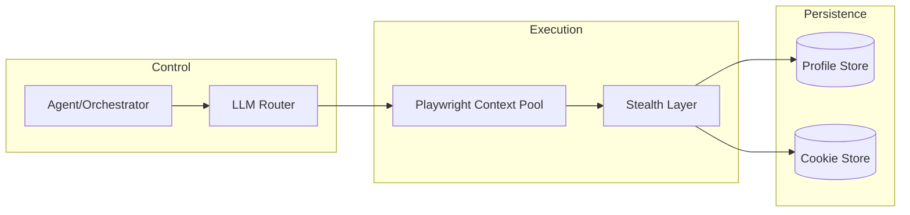

# Automation Development — Learning Report

**FORGE** — 2026-06-30
**Sources:** browser-use (102K), Playwright (92K), Puppeteer (95K), Automa, undetect-tools

---

## Table of Contents

1. Tool Comparison Matrix
2. Puppeteer vs Playwright vs browser-use — Deep Dive
3. Workflow Template Patterns
4. Anti-Detection Best Practices
5. Code Examples
6. Recommendations for Kvasir

---

## 1. Tool Comparison Matrix

| Dimension | Puppeteer | Playwright | browser-use | Automa |
|-----------|-----------|------------|-------------|--------|
| **Language** | JS/TS (93.8%) | JS/TS (91%), + Python/.NET/Java | Python (98.4%) | JS/Vue (browser ext) |
| **Browsers** | Chrome + Firefox (via BiDi) | Chromium + Firefox + WebKit | Any (via Chrome) | Chrome + Firefox |
| **Primary Use** | Headless Chrome control | Cross-browser E2E testing | AI agent browser automation | No-code visual automation |
| **AI-Native** | MCP via chrome-devtools-mcp | Native MCP server + CLI | Built-in LLM agent + Rust core | No |
| **Protocol** | CDP + WebDriver BiDi | CDP (auto-derived) | CDP via Playwright/Puppeteer | Extension API |
| **Stealth** | Plugin ecosystem | Limited | Cloud-only (paid tier) | N/A |
| **Stars** | 95.3K | 91.9K | 102K | ~12K |
| **License** | Apache-2.0 | Apache-2.0 | MIT | AGPL-3.0 |
| **Runtime** | Node.js | Node.js + standalone | Python 3.11+ | In-browser extension |

---

## 2. Puppeteer vs Playwright vs browser-use — Deep Dive

### 2.1 Puppeteer (95K stars, Google)

**Strengths:**
- The original headless Chrome library — most mature ecosystem
- Dual protocol support: CDP (Chrome-native) + WebDriver BiDi (cross-browser)
- ARIA/text-based locator API (`::-p-aria(Search)`, `::-p-text(...)`)
- MCP integration via chrome-devtools-mcp for AI agent workflows
- Lightweight: just you + the browser — no test runner overhead
- 685 releases, v25.2.1 as of June 2026

**Weaknesses:**
- Historically Chrome-only (Firefox support via BiDi is newer)
- No built-in auto-waiting — developers write `waitForSelector()` manually
- No native test runner (must pair with Jest/Mocha)
- Package manager install-script blocking is a recurring friction point
- No mobile device presets built into core

### 2.2 Playwright (92K stars, Microsoft)

**Strengths:**
- Single API across Chromium, Firefox, and WebKit
- Auto-waiting is baked in — elements wait to be actionable automatically
- First-class browser contexts for lightweight isolation (each context = fresh profile)
- MCP server (`@playwright/mcp`) is native — agents interact via accessibility trees, no vision model needed
- CLI agent mode (`@playwright/cli`) — described as "more token-efficient than MCP"
- Web-first assertions with automatic retry (`expect(page).toHaveTitle(...)`)
- Rich debugging: Trace Viewer replays every action with DOM snapshots + network
- Built-in test runner with parallel execution, retries, device emulation
- Cross-language: JS/TS + Python + .NET + Java

**Weaknesses:**
- Heavier than Puppeteer — full browser engines, more dependencies
- Playwright Test adds complexity for simple automation scripts
- Stealth/detection not a focus — designed for testing, not evading detection
- Browser binaries are large (each engine ~200-400MB)

### 2.3 browser-use (102K stars, Community)

**Strengths:**
- The first tool built specifically for AI-agent-driven browser automation
- Dual architecture: Python API + Rust core (new beta, v0.13+)
- Multi-provider LLM support through single `ChatBrowserUse` interface (OpenAI/Anthropic/Google)
- Custom tool extension via Python decorators
- CLI for persistent browser sessions between commands
- Cloud tier handles stealth, proxy rotation, CAPTCHA solving
- 129 releases, very active development (9,741 commits)

**Weaknesses:**
- Open-source core lacks stealth, CAPTCHA solving, proxy rotation — those are cloud-only
- Heavy resource usage ("Chrome can consume a lot of memory")
- Requires Python 3.11+
- Rust core is still in beta — potential instability
- Production parallel execution "can be tricky to manage" without cloud API
- Designed for AI agents, not for writing deterministic scripts

### 2.4 When to Use What

| Scenario | Best Tool |
|----------|-----------|
| Write deterministic E2E tests | Playwright |
| Quick headless Chrome script | Puppeteer |
| AI agent browses the web for you | browser-use |
| No-code visual workflows | Automa |
| Need maximum stealth | Puppeteer + C++ patches + manual config |
| Cross-browser testing | Playwright |
| Minimal dependencies | Puppeteer-core |
| LLM-driven browser control | browser-use beta or Playwright MCP |

---

## 3. Workflow Template Patterns

Based on all five projects, I identify these recurring patterns:

### 3.1 Direct Scripting Pattern (Puppeteer / Playwright Library)

```
Initialize Browser  →  Open Page  →  Find Element  →  Act  →  Extract  →  Close
```

Most common for scrapers, PDF generators, screenshots. Linear, predictable, no recovery logic.

### 3.2 AI Agent Loop Pattern (browser-use / Playwright MCP)

```
Initialize Agent  →  LLM Plans Step  →  Execute Browser Action  →  
  →  Observe Result  →  LLM Re-plans  →  ...  →  Task Complete
```

Key characteristics:
- Natural language task input, not scripted steps
- Persistent recovery loops — failed actions trigger re-planning
- Action space limited to browser (click, type, navigate, scroll, screenshot)
- LLM decides next step based on page state

### 3.3 Block-Based Visual Pattern (Automa)

```
Trigger (Manual/Schedule/Webhook) → Block Chain → Output
```

Blocks include: navigate, click, scrape, loop, condition, delay, screenshot, file write, keyboard input, proxy config, cookie management.

### 3.4 MCP Agent Pattern (Playwright MCP)

```
Agent ↔ MCP Server ↔ Browser
```

- Agent sends structured commands via MCP protocol
- Browser state returned as accessibility tree (not screenshots)
- Deterministic element refs (`[ref=e5]`) enable precise interaction
- No vision model needed — reduces token cost significantly
- Tools exposed: navigation, form filling, screenshots, network mocking, storage management

### 3.5 Hybrid Pattern (Recommended for Production)

For real-world automation at scale, I recommend:



---

## 4. Anti-Detection Best Practices

Synthesized from undetect-tools, browser-use cloud docs, and fingerprinting research:

### 4.1 The Detection Hierarchy

1. **IP/Network** — proxy quality, WebRTC leaks, DNS leaks, TCP/IP fingerprinting
2. **Browser Fingerprint** — canvas, WebGL, audio, fonts, WebRTC, timezone, language
3. **Behavioral** — mouse movements, typing speed, scroll patterns, navigation flow
4. **Automation Signals** — `navigator.webdriver`, CDP flags, window properties, global scope leakage
5. **Worker Scope** — `navigator.*` in Workers cannot be modified by extensions

### 4.2 Canonical Anti-Detection Checklist

| Layer | What to Do | Tools/Techniques |
|-------|------------|------------------|
| **Proxy** | Residential or 4G mobile; match proxy IP geo to browser timezone/lang | BrightData, WebShare, GeoNode |
| **Browser Core** | Use real Chrome (not Chromium); pass via `executablePath` | Separately downloaded Chrome |
| **Canvas/WebGL** | Patch at C++ level, not JS injection | Firefox-Stealth (15 C++ patches), PerfectCanvas |
| **Audio** | Spoof AudioContext fingerprint | Bablosoft Canvas Inspector |
| **WebRTC** | Disable when using proxies | `--disable-webrtc` flags |
| **Fonts** | Match OS font list to claimed platform | Firefox-Stealth font patches |
| **Timezone** | Match IP geo | Playwright `timezoneId` context option |
| **Viewport** | Match common screen resolution; `screen.availHeight` leaks | Realistic 1920x1080 common |
| **History** | Navigate via Google first or set `window.history.length` | Can't fully spoof without anti-detect browser |
| **Workers** | Invisible — must patch at C++ level | Firefox-Stealth, invisible_playwright |
| **CDP Flags** | Remove `--enable-automation`, patchnavigator.webdriver | Rebrowser, launch arg cleanup |
| **Mouse** | Bezier curves, realistic speed variation | Ghost-Cursor, HumanCursor |
| **Typing** | Variable inter-key delay with typos/backspace | Custom JS injection |

### 4.3 Which Anti-Detect Browsers Are Worth It

| Browser | Verdict | Why |
|---------|---------|-----|
| **Morelogin** | Good entry | 2 free, automation included |
| **Dolphin-anty** | Solid mid-range | 5 free, $89/100 profiles |
| **Bablosoft** | Unique | PerfectCanvas — only browser with real canvas emulation |
| **Camoufox** | Promising | Firefox-based, Python-launchable, automation included |
| **NSTBrowser** | Budget pick | 30 profiles/day free |
| **Multilogin** | Enterprise | €74+/month, gold standard but expensive |
| **GhostBrowser** | Marked useless | Easily detected |
| **puppeteer-extra-plugin-stealth** | Dismissed | "Trash — easily detected by CreepJS" |

### 4.4 C++ Over JS Injection

From the undetect-tools maintainer:

> "Patches at the C++ level are strictly superior to JS injection. JS can be detected via Worker scope leaks and `Object.getOwnPropertyNames(navigator)` checks. C++ patches modify the engine itself — Workers see the same spoofed values."

Key projects:
- **Firefox-Stealth** — 15 C++ patches against mozilla-central (Firefox 150.0.1)
- **invisible_playwright** — Patched Firefox 150 + Playwright wrapper, MIT licensed, self-hosted

---

## 5. Code Examples

### 5.1 Playwright — Basic Automation (JS/TS)

```typescript
import { chromium } from 'playwright';

async function main() {
  const browser = await chromium.launch({ headless: false });
  const context = await browser.newContext({
    viewport: { width: 1920, height: 1080 },
    locale: 'en-US',
    timezoneId: 'America/New_York',
  });
  const page = await context.newPage();

  await page.goto('https://example.com');
  await page.getByRole('button', { name: 'Sign in' }).click();
  await page.getByLabel('Email').fill('user@example.com');
  await page.getByLabel('Password').fill('password123');
  await page.getByRole('button', { name: 'Submit' }).click();
  
  const result = await page.textContent('.welcome-message');
  console.log('Result:', result);

  await browser.close();
}
```

### 5.2 Playwright MCP — AI Agent Mode

```json
// Claude Code MCP configuration
{
  "mcpServers": {
    "playwright": {
      "command": "npx",
      "args": ["@playwright/mcp@latest"]
    }
  }
}
```

Then from Claude Code:
```
> Navigate to github.com/browser-use/browser-use
> Find the star count
> Tell me how many stars it has
```

### 5.3 Puppeteer — With Stealth Configuration

```typescript
import puppeteer from 'puppeteer-extra';
import StealthPlugin from 'puppeteer-extra-plugin-stealth';

puppeteer.use(StealthPlugin());

const browser = await puppeteer.launch({
  headless: false,
  executablePath: '/path/to/real/chrome', // NOT Chromium
  args: [
    '--no-sandbox',
    '--disable-blink-features=AutomationControlled',
    '--disable-webrtc',
    '--disable-gpu',
    '--aggressive-cache-discard',
  ],
});

const page = await browser.newPage();
await page.setViewport({ width: 1920, height: 1080 });

// Override navigator.webdriver
await page.evaluateOnNewDocument(() => {
  Object.defineProperty(navigator, 'webdriver', { get: () => false });
});

// Realistic mouse movement
const { default: GhostCursor } = await import('ghost-cursor');
const cursor = GhostCursor.createCursor(page);
await cursor.click('button#submit');

await page.goto('https://example.com');
```

**NOTE:** puppeteer-extra-plugin-stealth is considered "trash" by undetect-tools maintainer. For serious stealth, use C++-patched browsers like Firefox-Stealth or invisible_playwright.

### 5.4 browser-use — AI Agent (Python)

```python
from browser_use.beta import Agent, BrowserProfile, ChatBrowserUse
import asyncio

async def main():
    agent = Agent(
        task="Go to Amazon, search for 'mechanical keyboard', "
             "find the first result under $100, and add it to cart.",
        llm=ChatBrowserUse(model='openai/gpt-5.5'),
        browser_profile=BrowserProfile(
            headless=False,
            allowed_domains=["*.amazon.com"],
        ),
    )
    history = await agent.run()
    print(history.final_result())

asyncio.run(main())
```

### 5.5 Custom Tool with browser-use

```python
from browser_use import Tools

tools = Tools()

@tools.action(
    description='Check if a product is in stock at a given URL.',
)
def check_stock(url: str) -> str:
    # Custom logic here
    import requests
    resp = requests.get(url)
    if 'out-of-stock' in resp.text:
        return 'OUT_OF_STOCK'
    return 'IN_STOCK'
```

### 5.6 Puppeteer — Accessibility-Tree Interaction

```typescript
import puppeteer from 'puppeteer';

const browser = await puppeteer.launch();
const page = await browser.newPage();
await page.goto('https://todo.example.com');

// Use ARIA locators (Puppeteer v22+)
await page.locator('::-p-aria(Add a new todo)').fill('Buy groceries');
await page.locator('::-p-text(Submit)').click();

const items = await page.locator('::-p-aria(Todo item)').all();
console.log(`Found ${items.length} todo items`);
```

### 5.7 Automa — Workflow JSON (Block-Based)

```json
{
  "workflow": {
    "id": "example-scraper",
    "blocks": [
      { "type": "navigate", "url": "https://example.com" },
      { "type": "wait", "timeout": 2000 },
      { "type": "scrape-attribute",
        "selector": ".product-title",
        "attribute": "textContent",
        "variable": "title" },
      { "type": "loop-each",
        "selector": ".product-item",
        "childBlocks": [
          { "type": "scrape-attribute",
            "selector": ".price",
            "attribute": "textContent",
            "variable": "price" },
          { "type": "output", "template": "{{title}}: {{price}}" }
        ]
      }
    ]
  }
}
```

---

## 6. Recommendations for Kvasir

### Tier 1: Core Foundation

**Use Playwright** as the primary automation engine.

Rationale:
- Cross-browser (Chromium + Firefox + WebKit) — most flexible
- Native MCP server means AI agents can drive browsers token-efficiently
- Auto-waiting eliminates the flakiest class of bugs
- Browser contexts provide profile isolation at near-zero cost
- Cross-language: same API in JS, Python, .NET, Java
- Largest dependency ecosystem (479K dependents)

### Tier 2: AI Agent Orchestration

**Layer browser-use on top of Playwright** for AI-driven workflows, OR use Playwright MCP directly.

Decision tree:
- If the task is **deterministic** (scrape, fill form, screenshot) — Playwright library
- If the task is **exploratory** (find X, compare Y, decide Z) — browser-use or Playwright MCP
- If you need maximum **stealth** — Playwright with invisible_playwright or Firefox-Stealth

### Tier 3: Anti-Detection

Start with Playwright context configuration (viewport, locale, timezone), then escalate:

1. **Basic**: Playwright context options + proxy
2. **Intermediate**: Puppeteer with Rebrowser or manual CDP flag cleanup + Ghost-Cursor
3. **Advanced**: C++-patched Firefox (Firefox-Stealth or invisible_playwright) + residential proxy + realistic behavior profiles
4. **Enterprise**: Commercial anti-detect browser (Multilogin, Dolphin-anty) with Playwright automation layer

### Tier 4: Workflow Templates for GemLogin/GemPhoneFarm Integration

Based on Automa patterns + our existing GemLogin workflow knowledge:

```
Workflow Template Categories:
├── Scraper (navigate → wait → extract → loop → output)
├── Form-filler (navigate → fill → submit → verify)
├── Monitor (navigate → check-condition → notify → loop)
├── Account-creator (proxy-assign → profile-init → fill-form → verify-otp → store-credentials)
└── AI-orchestrated (llm-plan → execute-navigate → observe → llm-replan → ...)
```

These map directly to GemLogin block types (navigate, js-code, condition, loop, delay, scrape) but with the knowledge that GemLogin requires all 18+ fields populated in every block — partial configs fail silently.

---

## Key Insights

1. **The market is converging on AI-native browser control.** Playwright added MCP + CLI agent modes in 2026. browser-use exploded to 102K stars by building exclusively for AI agents. Puppeteer added MCP via chrome-devtools-mcp. The trend is clear: manual scripting is being superseded by LLM-driven orchestration.

2. **For production stealth, avoid JS-level patches.** C++-level patching (Firefox-Stealth, invisible_playwright) is strictly superior because Worker scope cannot be modified by JS injection. The undetect-tools maintainer is blunt: puppeteer-extra-plugin-stealth is "trash."

3. **browser-use's open-source core is limited.** The most valuable features (stealth, CAPTCHA solving, proxy rotation, persistent memory, parallel execution) are cloud-only paid features. Self-hosting browser-use gives you an LLM API adapter, not a production automation platform.

4. **Playwright is the best foundation for Kvasir's automation needs.** It covers deterministic scripts, AI-driven workflows (via MCP), cross-browser testing, and has the richest debugging tooling. Combined with GemLogin for anti-detect profile management, Playwright handles the execution layer that our current stack needs.

---

*Report generated by FORGE — 2026-06-30*
